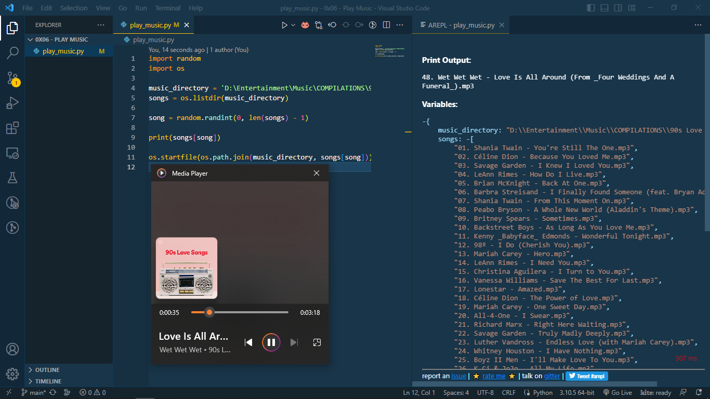

# Play Music Script (Randomly)

## Description

This Python script allows you to play a random song from a specified directory. It's a fun way to listen to music without having to choose a specific song manually.

## Prerequisites

Before running the script, make sure you have the following:

- Python 3.x installed on your system.
- A directory containing your music files (e.g., MP3 files) with the songs you want to play randomly.

## Usage

1. Clone or download this repository to your local machine.

2. Open a terminal or command prompt and navigate to the directory where the script is located.

3. Modify the `music_directory` variable in the script to point to your music directory.

   ```python
   music_directory = 'D:\Entertainment\Music\COMPILATIONS\90s Love Songs (2022)'

## Screenshot


